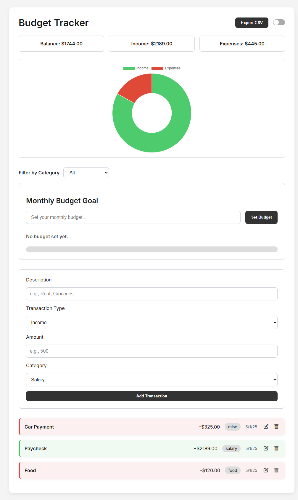
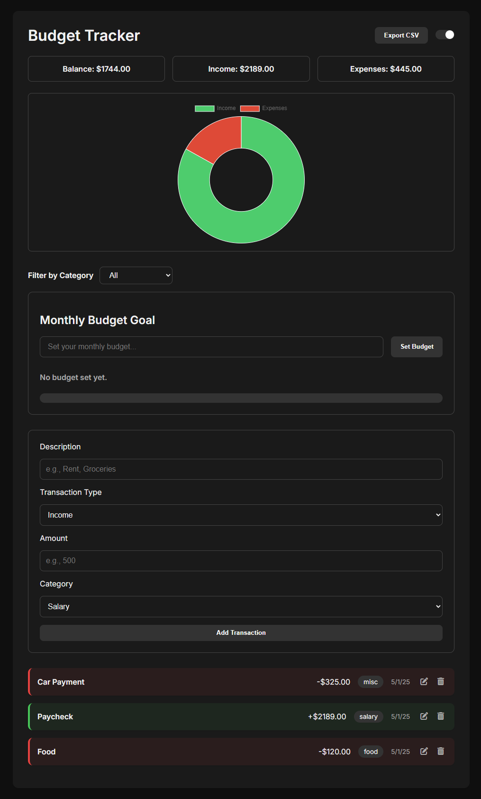

# Budget Tracker — Vanilla JS Archive

_Phase 1 (completed); future development continues in React_

This repository began as a pure **HTML / CSS / JavaScript** exercise to track personal income and expenses with real‑time feedback and persistent storage.  
After delivering a stable MVP, the roadmap pivoted to a full **React rewrite** (now under active development on the `phase-react` branch).  
This file freezes the original vanilla implementation for reference.

---

## ✨ Phase 1 Features

| Feature                              | Tech                         |
| ------------------------------------ | ---------------------------- |
| Add / delete income & expenses       | DOM + localStorage           |
| Live balance, income, expense totals | JS array methods             |
| Doughnut chart                       | Chart.js 3                   |
| Dark / light theme                   | CSS variables + localStorage |
| Monthly budget bar                   | Vanilla JS                   |
| CSV export                           | Blob API                     |
| Mobile‑first layout                  | Flexbox / media queries      |

---

## 🧠 Development Journey

> **Goal:** deliver a working MVP with clean UI and persistent data.

### Milestones

1. **MVP scaffold** – static HTML → dynamic list with `localStorage`.
2. **Visual feedback** – integrated Chart.js and responsive styling.
3. **Functional polish** – budget goals, CSV export, inline deletes.

With the core feature‑set complete and code complexity growing, the project moved to **Phase 2: React rewrite** for better component structure and long‑term scalability.

---

## 🛠️ Lessons Learned

| Challenge                                     | What I Did                                                         |
| --------------------------------------------- | ------------------------------------------------------------------ |
| Expenses stored as positives, breaking totals | Stored expenses as negative numbers and updated math helpers.      |
| Chart duplicated after each transaction       | Destroyed the existing Chart.js instance before re‑render.         |
| Dark mode reset on refresh                    | Saved theme preference to localStorage and applied on page load.   |
| Budget bar didn’t refresh on delete           | Centralized total‑recalculation inside a single `updateUI()` call. |
| CSV export missing UTF‑8 header               | Used `Blob` with `text/csv;charset=utf-8` for Excel compatibility. |

---

## 📈 Road Ahead

Phase 1 is feature‑complete.  
All new work—including Context API state, tests, and deployment—will occur in the React code‑base.

---

## Screenshots

| Light                         | Dark                        |
| ----------------------------- | --------------------------- |
|  |  |
